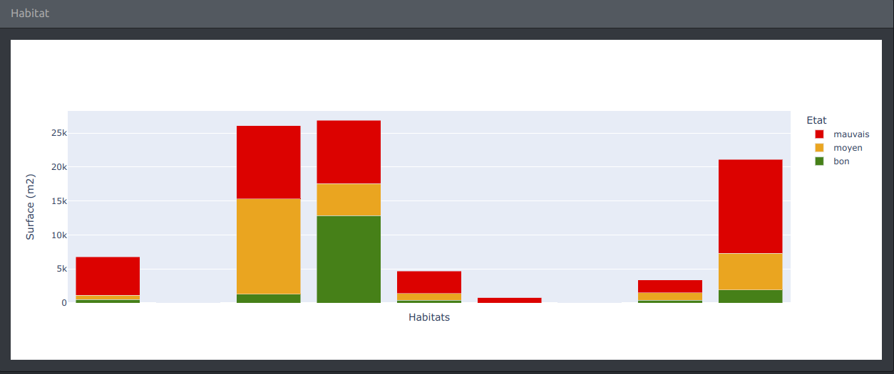

# Les zones humides

Application web pour la consultation des données relatives à l'état et à la gestion des zones humides sur le territoire du Parc national du Mercantour.

Le programme de suivi bénéficie du soutien financier de l'agence de l'eau Rhône - Méditerranée.

## Zone d'étude

Deux menus déroulants permettent de sélectionner dans des listes (en ouvrant le menu ou en tapant une partie du nom recherché) la vallée ou le site à étudier.

Lorsqu'une vallée est sélectionnée, seuls les sites de cette vallée sont proposés au choix.  
Lorsqu'aucune vallée n'est sélectionnée, tous les sites sont proposés au choix. Le choix d'un site entraîne la sélection automatique de la vallée de rattachement.

Il est également possible de sélectionner directement un site ou une vallée en cliquant sur l'une des cartes, sans utiliser les menus déroulants.

## Carte de situation

La carte de situation permet de voir d'un coup d'oeil la localisation géographique de la zone d'étude courante (l'ensemble du parc, une vallée ou un site).
Un clic sur la carte permet de changer de vallée ou de revenir à l'emprise globale.

## Carte des zones humides

La carte des zones humide permet de sélectionner la zone à étudier (en cliquant) et d'obtenir des informations sur les objets affichés en les survolant (info-bulles).

Le mode de présentation dépend de la zone d'étude courante :

- ensemble du territoire, lorsqu'aucune vallée n'est sélectionnée. La carte zoome sur l'emprise du parc et donne un aperçu des vallées et des sites (code couleur).  
  
- vallée, lorsqu'aucun site n'est sélectionné. La carte zoome sur la vallée sélectionnée (affichée en jaune) et affiche les sites de cette vallée sous la forme de points colorés suivant leur état de conservation.  
  
- site, lorsqu'un site est sélectionné. La carte zoome sur l'emprise du site sélectionné et affiche les zones humides, défens et altérations du site. Dans ce mode, il est possible de sélectionner/désélectionner une zone humide pour afficher en détail les habitats constituant la zone humide et l'état de conservation.  
  

L'outil de paramétrage de la carte (en haut à droite de la carte) permet de choisir le fonds de carte et d'afficher de façon sélective des objets sur la carte (des info-bulles s'affichent en survolant les objets situés au premier plan):

- Zones humides
- Défens
- Altérations
- Espaces de bon fonctionnement
- Relevés [Rhomeo](https://rhomeo-bao.fr/?q=programme) sur 10 sites

  Il est aussi possible de zoomer avec la souris ou en utilisant l'outil de zoom en haut à gauche de la carte. Le zoom manuel n'affecte pas le mode de présentation.

## Etat de conservation

Ce graphique affiche en parts relatives l'état de conservation de la zone d'étude (parc, vallée, site)

## Habitat

Ce graphique affiche les habitats (surface et état) de la zone d'étude (parc, vallée, site ou zone humide lorsqu'une une zone humide est sélectionnée).

## Mesures de gestion

Les notices de gestion de la zone d'étude peuvent être téléchargées.

## Rhomeo

Les 10 sites qui font l'objet d'une étude des sols et de végétation [Rhomeo](https://rhomeo-bao.fr/?q=programme) sont représentés avec des marqueurs plus gros que les autres sites.
L'affichage des relevés Rhomeo permet également de localiser ces sites (points violets sur la carte).

Lorsque la zone d'étude correspond à l'un de ces sites Rhomeo, les indicateurs Rhomeo calculés pour ce site s'affichent dans une boîte spécifique en dessous des mesures de gestion.
